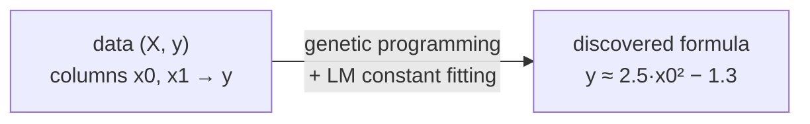

# rsymbolic2

**Symbolic regression that finds a human-readable formula for your data** — a native
C++ engine with an R interface and a Python interface. It searches the space of
mathematical expressions with genetic programming and tunes the constants in each
candidate with a Levenberg–Marquardt least-squares optimiser.

The defaults are **matched to [PySR](https://github.com/MilesCranmer/PySR)'s
documented defaults**, so results are directly comparable; only the *implementation*
differs. Unlike PySR, the engine is pure C++ with **no Julia runtime** — there is no
JIT warm-up — and the **search engine itself has no third-party C++ dependency**: the
search and its self-contained Levenberg–Marquardt constant optimiser are plain C++/STL
(the engine builds with just a C++17 compiler, plus OpenMP if available for
parallelism). The language bindings use one small helper each — `Rcpp` for R, `pybind11`
for Python.

> rsymbolic2 is an **independent re-implementation** and is **not affiliated with,
> endorsed by, or sponsored by PySR / SymbolicRegression.jl**. It is licensed under the
> Apache License 2.0; see [`NOTICE`](NOTICE) for attribution. "PySR" is referenced only
> to describe default compatibility.



---

## Table of contents

- [What is symbolic regression?](#what-is-symbolic-regression)
- [Installation](#installation)
  - [Prerequisites: a C++ toolchain](#prerequisites-a-c-toolchain)
  - [Python](#install-python)
  - [R](#install-r)
- [Tutorial](#tutorial)
  - [Python tutorial](#python-tutorial)
  - [R tutorial](#r-tutorial)
- [Worked examples](#worked-examples)
- [Function reference (parameters)](#function-reference-parameters)
- [Operators](#operators)
- [How the algorithm works](#how-the-algorithm-works)
- [PySR default parity](#pysr-default-parity)
- [References](#references)
- [License](#license)

---

## What is symbolic regression?

Ordinary regression fixes the *form* of the model (say, a line `y = a·x + b`) and only
fits its coefficients. **Symbolic regression searches over the form of the equation
itself** — the operators, the structure, *and* the constants — and returns a compact
closed-form expression. This makes the result interpretable: instead of a black-box
weight matrix you get something like `y = 2.5·x² − 1.3` that you can read, reason
about, and check against domain knowledge.

The price is that the space of expressions is enormous and discrete, so the search is
the hard part. rsymbolic2 uses **evolutionary search** (genetic programming) to explore
expression structures and a **nonlinear least-squares optimiser** to fit the numeric
constants inside each candidate. See [How the algorithm works](#how-the-algorithm-works).

---

## Installation

rsymbolic2 is currently installed **from source** (a clone of this repository). Both
the Python and R packages compile the same C++ core, so they share one prerequisite: a
working C++17 compiler.

### Prerequisites: a C++ toolchain

| Platform | What to install | Notes |
|----------|-----------------|-------|
| **Windows** | [Rtools](https://cran.r-project.org/bin/windows/Rtools/) (45 or newer) | Provides GCC, CMake, and `make` under `C:\rtools45`. The R package *requires* Rtools anyway; the Python package reuses the same compiler. |
| **Ubuntu / Debian** | `sudo apt install build-essential cmake` | GCC + CMake. |
| **macOS** | `xcode-select --install` and `brew install cmake libomp` | OpenMP (`libomp`) is optional — the engine falls back to a correct serial path without it. |

> **Windows tip.** Make sure the Rtools binaries are on your `PATH` so that `gcc` and
> `cmake` are found, e.g. add `C:\rtools45\x86_64-w64-mingw32.static.posix\bin` and
> `C:\rtools45\usr\bin`. You can verify with `gcc --version` and `cmake --version`.

There is **no third-party C++ library to install for the engine** — it depends only on
the C++ standard library (and OpenMP, if present, for island parallelism). The language
bindings pull in one build-time helper each, handled automatically by the installer:
`Rcpp` (R) and `pybind11` (Python).

### Install: Python

Requires Python ≥ 3.9 and NumPy, plus the C++ toolchain above.

**Directly from GitHub** (no manual clone). The package lives in the `python/`
subdirectory, so the URL must point at it with `#subdirectory=python`:

```bash
pip install "git+https://github.com/ToshihiroIguchi/rsymbolic2.git#subdirectory=python"
```

pip clones the whole repository (the build references the shared C++ core in
`r-package/rsymbolic2/src/`, which lives outside `python/`), compiles the extension,
and installs the wheel.

**From a local clone** (for development, or if you already have the source):

```bash
git clone https://github.com/ToshihiroIguchi/rsymbolic2.git
cd rsymbolic2

# Build and install the Python package (compiles the C++ core; takes a minute or two).
pip install ./python
```

Either way, that single `pip install` command pulls in the build tools
(`scikit-build-core`, `pybind11`, `cmake`, `ninja`) into an isolated build
environment automatically, compiles the extension with your C++ toolchain, and
installs the `rsymbolic2` package.

Check it works:

```bash
python -c "import rsymbolic2; print(rsymbolic2.__version__)"
```

<details>
<summary>Troubleshooting / development install</summary>

- **For an editable / development install** (rebuild on import, no copy):
  ```bash
  pip install scikit-build-core pybind11 numpy ninja
  pip install --no-build-isolation -e ./python
  ```
- **"Shared C++ core not found"** means you are building outside a full repository
  checkout — the Python package references the shared core in
  `r-package/rsymbolic2/src/`. Build from a complete clone.
- **Compiler not found on Windows**: confirm `gcc` and `cmake` are on `PATH` (see the
  Windows tip above), then retry.
- Optional extras: `pip install "./python[pandas,plot]"` enables `result.to_pandas()`
  and the plotting helpers in the examples. From GitHub, append the extras to the URL:
  `pip install "rsymbolic2[pandas,plot] @ git+https://github.com/ToshihiroIguchi/rsymbolic2.git#subdirectory=python"`.

</details>

### Install: R

Requires R ≥ 4.2 and (on Windows) Rtools.

**Directly from GitHub** (needs the `remotes` package). The package lives in the
`r-package/rsymbolic2` subdirectory, so `subdir` is required:

```r
install.packages("remotes")
remotes::install_github("ToshihiroIguchi/rsymbolic2",
                        subdir = "r-package/rsymbolic2")
```

`remotes` builds a clean source package and installs it; the only build-time
dependency it pulls in is `Rcpp`. `devtools::install_github(..., subdir = ...)` works
the same way if you already have devtools.

**From a local clone**, no `remotes`/`devtools` needed — install the source directory
directly:

```r
# From an R session at the repository root:
install.packages("Rcpp")                          # the only build-time dependency
install.packages("r-package/rsymbolic2", repos = NULL, type = "source")
```

or, equivalently, from a shell:

```bash
R CMD INSTALL r-package/rsymbolic2
```

Check it works:

```r
library(rsymbolic2)
packageVersion("rsymbolic2")
```

---

## Tutorial

This tutorial walks through the whole workflow step by step: make some data, run the
search, read the result, and predict on new points. Both language versions follow the
same workflow with the same parameters and defaults.

### Python tutorial

**Step 1 — import and make data.** We use a simple noiseless quadratic so the recovery
is obvious. `X` is a 2-D array of shape `(n_samples, n_features)`; `y` is 1-D.

```python
import numpy as np
from rsymbolic2 import symbolic_regression

rng = np.random.default_rng(0)
X = np.linspace(-3, 3, 60).reshape(-1, 1)     # one feature -> column x0
y = 2.5 * X[:, 0] ** 2 - 1.3                  # the formula we hope to recover
```

**Step 2 — run the search.** Operators are the one input you must choose (PySR ships no
default operator set either). Here the target is a square, so we allow the `square`
unary operator. `seed` makes the run reproducible.

```python
result = symbolic_regression(
    X, y,
    binary_ops=["add", "sub", "mul"],   # +  -  *
    unary_ops=["square"],               # x -> x**2
    seed=1,
)
```

> Using the full PySR defaults (`generations=2800`, `n_populations=31`) gives the best
> recovery but can take a while. For a quick first run, lower them, e.g.
> `population_size=200, generations=60`.

**Step 3 — read the result.**

```python
print(result.expression)     # lowest-loss formula, e.g. ((square(x0) * 2.5) - 1.3)
print(result.loss)           # training sum-of-squared-errors
print(result.recommended)    # Pareto "best" accuracy/complexity trade-off
print(result)                # pretty-prints the whole Pareto front
```

**Step 4 — predict on new data.** `predict` evaluates the recommended formula (pass
`expression=` to use a different one). A 1-D input is treated as a single column.

```python
X_new = np.array([[0.0], [1.0], [-2.0]])
print(result.predict(X_new))             # ≈ [-1.3, 1.2, 8.7]
```

**Step 5 (optional) — inspect the Pareto front as a table.**

```python
df = result.to_pandas()      # requires pandas: pip install "./python[pandas]"
print(df)                    # columns: complexity, loss, expression
```

### R tutorial

**Step 1 — load and make data.** `X` is a matrix (rows = observations, columns =
features); a plain vector is treated as one column.

```r
library(rsymbolic2)

X <- matrix(seq(-3, 3, length.out = 60), ncol = 1)   # one feature -> column x0
y <- 2.5 * X[, 1]^2 - 1.3
```

**Step 2 — run the search.**

```r
result <- symbolic_regression(
  X, y,
  binary_ops = c("add", "sub", "mul"),   # +  -  *
  unary_ops  = c("square"),              # x -> x^2
  seed       = 1L
)
```

> As in Python, the full PySR defaults are thorough but slow; for a quick run pass
> e.g. `population_size = 200L, generations = 60L`.

**Step 3 — read the result.**

```r
result$expression     # lowest-loss formula, e.g. ((square(x0) * 2.5) - 1.3)
result$loss           # training sum-of-squared-errors
result$recommended    # Pareto "best" trade-off
result$pareto_front   # data frame: complexity, loss, expression
```

**Step 4 — predict on new data.**

```r
X_new <- matrix(c(0, 1, -2), ncol = 1)
predict(result, X_new)         # ≈ c(-1.3, 1.2, 8.7)
```

**Step 5 (optional) — plot the Pareto front** (requires ggplot2):

```r
plot(result)                   # complexity vs. loss, best point highlighted
```

---

## Worked examples

### Multivariate recovery (Python)

`X` has two columns, so the variables in the formula are `x0` and `x1`.

```python
import numpy as np
from rsymbolic2 import symbolic_regression

rng = np.random.default_rng(0)
X = rng.uniform(-2, 2, size=(200, 2))
y = X[:, 0] * X[:, 1] + np.sin(X[:, 0])        # target: x0*x1 + sin(x0)

result = symbolic_regression(
    X, y,
    binary_ops=["add", "sub", "mul"],
    unary_ops=["sin", "cos"],
    population_size=200, generations=200, seed=3,
)
print(result.recommended)
print("MSE:", np.mean((result.predict(X) - y) ** 2))
```

### Noisy data and the accuracy/complexity trade-off (R)

With noise you usually do **not** want the lowest-loss (most complex) formula but the
`recommended` one, which is the "knee" of the Pareto front. Use `model_selection` to
change that policy.

```r
library(rsymbolic2)

set.seed(1)
X <- matrix(runif(150, -3, 3), ncol = 1)
y <- 0.5 * X[, 1]^2 + rnorm(150, sd = 0.2)     # quadratic + noise

result <- symbolic_regression(
  X, y,
  binary_ops = c("add", "sub", "mul"),
  unary_ops  = c("square"),
  population_size = 200L, generations = 100L,
  model_selection = "best",                    # "best" | "accuracy" | "score"
  seed = 1L
)
result$recommended
result$pareto_front     # inspect the whole front to choose a model yourself
```

### Weighted fit and early stopping (Python)

```python
import numpy as np
from rsymbolic2 import symbolic_regression

X = np.linspace(0, 1, 50).reshape(-1, 1)
y = 3.0 * X[:, 0] + 0.5
w = np.linspace(1.0, 5.0, 50)                  # weight later points more

result = symbolic_regression(
    X, y,
    binary_ops=["add", "mul"], unary_ops=[],
    weights=w,                                 # weighted least squares
    early_stop_condition=1e-8,                 # stop once loss is small enough
    timeout_seconds=30,                        # ...or after 30 s, whichever first
    seed=0,
)
print(result.expression)
```

---

## Function reference (parameters)

The Python `symbolic_regression(...)` and R `symbolic_regression(...)` take the same
parameters with the same defaults (Python uses snake_case keyword arguments; R uses the
same names). **Every default below equals PySR's documented default** — see
[PySR default parity](#pysr-default-parity).

| Parameter | Default | Meaning (PySR name) |
|-----------|---------|---------------------|
| `population_size` | `27` | Candidates per island (`population_size`). |
| `n_populations` | `31` | Parallel island populations (`populations`). |
| `generations` | `2800` | Evolution generations; `population_size` steps each (maps to PySR `niterations`×`ncycles_per_iteration`). |
| `tournament_size` | `15` | Tournament size (`tournament_selection_n`). |
| `tournament_selection_p` | `0.982` | Probabilistic tournament strength (`tournament_selection_p`). |
| `binary_ops` | `add, sub, mul` | Allowed binary operators (shared problem input). |
| `unary_ops` | `neg, exp, log, sin, cos` | Allowed unary operators (shared problem input). |
| `max_nodes` | `30` | Max expression size (`maxsize`). |
| `max_depth` | `30` | Max tree depth (`maxdepth`). |
| `crossover_probability` | `0.0259` | Crossover vs. mutation (`crossover_probability`). |
| `parsimony` | `0.0` | Fixed linear complexity penalty (`parsimony`; off by default). |
| `adaptive_parsimony_scaling` | `1040.0` | Frequency-adaptive complexity pressure (`adaptive_parsimony_scaling`). |
| `optimize_probability` | `0.14` | Per-iteration constant-optimisation probability (`optimize_probability`). |
| `should_optimize_constants` | `True` | Run the constant-optimisation pass (`should_optimize_constants`). |
| `fraction_replaced_hof` | `0.0614` | Hall-of-fame migration fraction (`fraction_replaced_hof`). |
| `mutation_weights` | `None` | Override relative mutation-kind weights (`MutationWeights`). |
| `model_selection` | `"best"` | Which Pareto member is `recommended` (`model_selection`). |
| `weights` | `None` | Per-point weights for weighted least squares (`weights`). |
| `early_stop_condition` | `0.0` | Extra early-stop loss threshold (`early_stop_condition`). |
| `max_evals` | `0` | Cap on total evaluations, `0` = off (`max_evals`). |
| `target_loss` | `1e-10` | Early-stop loss threshold. |
| `simplify` | `True` | Algebraically simplify candidates. |
| `seed` | `0` | Random seed (`0` = nondeterministic). |
| `timeout_seconds` | `0.0` | Wall-clock limit, `0` = none. |
| `verbosity` | `0` | `1` prints one line per epoch to stderr. |

**Result object.** Both languages return: `expression` (lowest-loss formula),
`loss`, `complexity`, `recommended` (Pareto pick), `best_index`, and `pareto_front`
(complexity / loss / expression). Python additionally exposes `.predict()` and
`.to_pandas()`; R provides S3 `predict()` and `plot()` methods.

---

## Operators

Operators are the **one input you choose per problem** — they define the search space.
They are *not* a tuning knob and PySR ships no default operator set either, so for a
fair comparison the same operator set is given to both tools.

- **Binary:** `add` (`+`), `sub` (`−`), `mul` (`×`), `div` (`÷`), `pow` (`^`).
- **Unary:** `neg` (`−x`), `exp`, `log`, `sin`, `cos`, `sqrt`, `tanh`, `abs`,
  `square` (`x²` as a single cheap node).

Two operators are **protected** so that an invalid intermediate value cannot poison the
least-squares solver with `NaN` (matching SymbolicRegression.jl's `safe_*` semantics):

- `sqrt(x)` returns `0` for `x < 0`.
- `pow(x, y)` returns `0` when `x ≤ 0` and the result would be undefined.

> Note: during **prediction**, `pow` uses the host language's ordinary power operator
> (`**` / `^`), which can return `NaN` for a negative base with a fractional exponent.
> This only matters if your data domain includes such inputs.

---

## How the algorithm works

rsymbolic2 implements the same search PySR / SymbolicRegression.jl uses — *regularized
evolution of expression trees with inner constant optimisation* — re-implemented in
C++. Below is what actually runs, end to end.

### 1. Expression representation

Each candidate is a binary **expression tree** whose leaves are input variables
(`x0, x1, …`) or numeric constants, and whose internal nodes are operators. Trees are
stored in a **contiguous array in postfix order** (children before parents), inspired by
Operon [[Burlacu 2020]](#references). This lets a simple stack machine evaluate a tree
with no pointer chasing — better cache behaviour than a heap of linked nodes, which
matters because evaluation is the inner-loop hot path.

### 2. Evolutionary search (regularized evolution)

The search is **genetic programming** [[Koza 1992]](#references) run as **regularized
evolution** [[Real 2019]](#references): a steady-state loop that repeatedly improves a
population of candidate trees.

One *generation* performs `population_size` steps; each step:

1. **Tournament selection.** Sample `tournament_size` members at random and pick a
   parent. Selection is *probabilistic*: the rank-`r` best is chosen with probability
   `p·(1−p)^r` (`tournament_selection_p`), so a slightly worse parent is occasionally
   taken to preserve diversity.
2. **Variation.** With probability `crossover_probability` do **subtree crossover**
   between two parents; otherwise apply one **mutation** chosen from a weighted set
   (`mutation_weights`): perturb a constant, change an operator, swap operands, rotate
   the tree, add / insert / delete a node, randomize, simplify, or do nothing.
3. **Constant optimisation** (probabilistically, see §3) and evaluation.
4. **Replacement.** The offspring replaces a member of the population.

**Adaptive parsimony.** To avoid bloat and premature collapse to one size, selection
multiplies a candidate's cost by `exp(adaptive_parsimony_scaling · f)`, where `f` is the
normalised frequency of that candidate's *complexity* in a running histogram. This
penalises *over-represented* sizes rather than *large* ones — a self-balancing pressure
borrowed from SymbolicRegression.jl. A frequency-based **mutation-acceptance** test
applies the same idea at mutation time.

**Island model.** `n_populations` independent populations evolve in parallel
([OpenMP](https://www.openmp.org); a correct serial fallback is used when OpenMP is
absent). Periodically the best individuals **migrate** between islands and from a global
elite archive (`fraction_replaced_hof`), spreading good building blocks while keeping
populations diverse.

### 3. Constant optimisation (Levenberg–Marquardt)

A tree fixes the *structure*; the numeric constants inside it are then fitted by
minimising the (optionally weighted) sum of squared residuals. This is a small dense
**nonlinear least-squares** problem (usually 1–5 constants), solved with the
**Levenberg–Marquardt** algorithm [[Levenberg 1944]](#references)
[[Marquardt 1963]](#references) — a damped Gauss–Newton method that interpolates between
gradient descent and Newton steps.

- The solver (`self-LM`) is a compact, **dependency-free** hand-written implementation
  (normal-equations LM with Marquardt damping and a small in-place Cholesky solve); it
  pulls in no third-party linear-algebra or optimisation library. (PySR uses BFGS via
  Optim.jl; the optimiser choice is an *implementation* difference, not a behavioural
  one — see [parity](#pysr-default-parity).)
- **Gradients** come from **forward-mode automatic differentiation** using dual numbers
  [[Griewank 2008]](#references): the tree is evaluated over a dual-number type so the
  value and its derivatives w.r.t. the constants are computed together, exactly (no
  finite-difference error). This is verified in the test suite against finite
  differences.
- **Multi-start.** Each fit runs from the incumbent constants plus a few perturbed
  restarts and keeps the best, escaping poor local minima. A fit is only accepted if it
  lowers the loss.
- Optimisation is **not** run on every candidate (that would dominate compute). It runs
  once per iteration on a `optimize_probability` fraction of the population, matching
  SymbolicRegression.jl.

### 4. Simplification

Fitted candidates are passed through a rule-based algebraic **simplifier** (constant
folding, identity elimination such as `x+0→x` and `x·1→x`, double negation, etc.). This
keeps expressions compact and readable and removes redundant structure before it is
archived.

### 5. Selecting the answer (the Pareto front)

Accuracy and simplicity trade off against each other, so the engine keeps a **Pareto
front** (a "hall of fame"): the best expression found at *each* complexity level, with
dominated ones discarded. From this front, `model_selection` chooses what to recommend:

- `"accuracy"` — the lowest-loss (most complex) member;
- `"score"` — the steepest loss-drop-per-complexity "knee" over the whole front;
- `"best"` (default) — that same knee, but only among members within 1.5× of the most
  accurate loss.

The full front is always returned so you can apply your own judgement.

### Differences from PySR (implementation only)

Same *search and defaults*, different *engine*: C++ with no Julia runtime (no JIT
warm-up); a self-implemented LM constant optimiser instead of BFGS; Float64 throughout;
and OpenMP island parallelism. These change *how* a result is computed, never *which*
settings define the search. The full design rationale lives in [`docs/`](docs/).

---

## PySR default parity

A core rule of this project: **rsymbolic2's default configuration and search behaviour
are identical to PySR's documented defaults; only the implementation method differs.**
The authoritative source is PySR's installed `pysr/sr.py` `PySRRegressor.__init__` and
the SymbolicRegression.jl mechanisms it drives. The full default table, the exact
mechanisms (frequency-adaptive parsimony normalisation, cost formula, mutation-weight
set, tournament, migration), and the rationale are documented in
[`docs/28_pysr_default_parity_spec.md`](docs/28_pysr_default_parity_spec.md).

Allowed *implementation* divergences (these change *how*, not *what*): the C++ core with
no Julia runtime; the constant optimiser (self-LM vs. PySR's BFGS); Float64 vs. PySR's
`precision=32`; and the parallelism mechanism / RNG stream. Operators are the shared
problem input, given identically to both tools, not a default to copy.

---

## References

Algorithms and tools rsymbolic2 builds on:

- **PySR / SymbolicRegression.jl** — M. Cranmer, *Interpretable Machine Learning for
  Science with PySR and SymbolicRegression.jl* (2023).
  [arXiv:2305.01582](https://arxiv.org/abs/2305.01582) ·
  [PySR](https://github.com/MilesCranmer/PySR) ·
  [SymbolicRegression.jl](https://github.com/MilesCranmer/SymbolicRegression.jl)
- <a id="ref-koza"></a>**Genetic programming** — J. R. Koza, *Genetic Programming: On
  the Programming of Computers by Means of Natural Selection*, MIT Press (1992).
- <a id="ref-real"></a>**Regularized evolution** — E. Real, A. Aggarwal, Y. Huang, Q. V.
  Le, *Regularized Evolution for Image Classifier Architecture Search*, AAAI (2019).
  [arXiv:1802.01548](https://arxiv.org/abs/1802.01548)
- <a id="ref-operon"></a>**Operon (linear tree encoding)** — B. Burlacu, G. Kronberger,
  M. Kommenda, *Operon C++: An Efficient Genetic Programming Framework for Symbolic
  Regression*, GECCO Companion (2020).
  [doi:10.1145/3377929.3398099](https://doi.org/10.1145/3377929.3398099) ·
  [Operon](https://github.com/heal-research/operon)
- <a id="ref-levenberg"></a>**Levenberg–Marquardt** — K. Levenberg, *A Method for the
  Solution of Certain Non-Linear Problems in Least Squares*, Quart. Appl. Math. 2
  (1944), 164–168.
- <a id="ref-marquardt"></a>D. W. Marquardt, *An Algorithm for Least-Squares Estimation
  of Nonlinear Parameters*, SIAM J. Appl. Math. 11 (1963), 431–441.
  [doi:10.1137/0111030](https://doi.org/10.1137/0111030)
- J. Nocedal, S. J. Wright, *Numerical Optimization*, 2nd ed., Springer (2006) — LM and
  Gauss–Newton background.
- <a id="ref-griewank"></a>**Automatic differentiation (dual numbers)** — A. Griewank,
  A. Walther, *Evaluating Derivatives: Principles and Techniques of Algorithmic
  Differentiation*, 2nd ed., SIAM (2008).
- **OpenMP** (island-model parallelism) — <https://www.openmp.org>

Benchmarks used to evaluate the engine (see [`docs/`](docs/)):

- **AI Feynman** (ground-truth recovery) — S. Udrescu, M. Tegmark, *AI Feynman: A
  Physics-Inspired Method for Symbolic Regression*, Science Advances (2020).
  [arXiv:1905.11481](https://arxiv.org/abs/1905.11481) ·
  [AIFeynman](https://github.com/SciML/AIFeynman)
- **SRBench** — W. La Cava et al., *Contemporary Symbolic Regression Methods and their
  Relative Performance*, NeurIPS Datasets & Benchmarks (2021).
  [arXiv:2107.14351](https://arxiv.org/abs/2107.14351) ·
  [srbench](https://github.com/cavalab/srbench)

---

## License

**Apache License 2.0.** See [`LICENSE`](LICENSE) for the full text and
[`NOTICE`](NOTICE) for attribution.

rsymbolic2's default settings and search behaviour are an independent
re-implementation matched to the documented defaults of **PySR** and
**SymbolicRegression.jl** (both Apache-2.0, © Miles Cranmer); attribution is given in
`NOTICE` per Apache License 2.0 §4. rsymbolic2 is not affiliated with or endorsed by
those projects.

The engine depends only on the C++ standard library. The language bindings use `Rcpp`
(R; GPL ≥ 2) and `pybind11` (Python; BSD-3) — see `NOTICE`.
