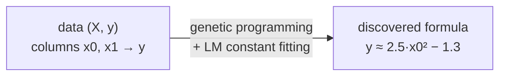

# rsymbolic2

**Symbolic regression that finds a human-readable formula for your data** — a native
C++ engine with an R interface and a Python interface. It searches the space of
mathematical expressions with genetic programming and tunes the constants in each
candidate with a Levenberg–Marquardt least-squares optimiser.

- **Pure C++ engine, no Julia runtime** — and therefore no JIT warm-up.
- **Zero third-party C++ dependency in the engine** — the search and its self-contained
  Levenberg–Marquardt constant optimiser are plain C++/STL (just a C++17 compiler, plus
  OpenMP if available for parallelism).
- **Defaults matched to [PySR](https://github.com/MilesCranmer/PySR)** — results are
  directly comparable; only the *implementation* differs.
- **Thin language bindings** — one small helper each: `cpp11` for R, `pybind11` for Python.

> An **independent re-implementation**, **not affiliated with or endorsed by** PySR /
> SymbolicRegression.jl. Apache-2.0; attribution in [`NOTICE`](NOTICE). See
> [License](#license) for details.


```mermaid
flowchart LR
    D["data (X, y)<br/>columns x0, x1 → y"]
    F["discovered formula<br/>y ≈ 2.5·x0² − 1.3"]
    D -->|"genetic programming<br/>+ LM constant fitting"| F
```

---

## Table of contents

- [Try it in the browser (no install)](#try-it-in-the-browser-no-install)
- [Quickstart (Google Colab)](#quickstart-google-colab-no-local-setup)
- [What is symbolic regression?](#what-is-symbolic-regression)
- [Installation](#installation)
  - [Prerequisites: a C++ toolchain](#prerequisites-a-c-toolchain)
  - [Python](#install-python)
  - [R](#install-r)
- [Tutorial](#tutorial)
  - [Python tutorial](#python-tutorial)
  - [R tutorial](#r-tutorial)
- [Worked examples](#worked-examples)
- [Operators](#operators)
- [Function reference (parameters)](#function-reference-parameters)
- [How the algorithm works](#how-the-algorithm-works)
- [PySR default parity](#pysr-default-parity)
- [References](#references)
- [License](#license)

---

## Try it in the browser (no install)

**<https://toshihiroiguchi.github.io/rsymbolic2/>** — the same C++ engine compiled to
WebAssembly, running entirely in your browser: load a CSV (or one of the built-in
examples), pick the target column and the operators, and watch the Pareto front fill in.
Nothing is uploaded — the search runs on your machine — and the page hands back a ready
R or Python snippet that reproduces the run in the packages.

It is a **demonstration front end**, not the library: it is single-threaded with a fixed
128 MB heap, so roughly 10,000 cells (rows × fitted columns) run comfortably and large
tables are sampled down; and it highlights the parsimony elbow (`model_selection =
"score"`) rather than PySR's `best`, which is the one place the GUI is allowed to differ
from the packages — the *search* is the same PySR-parity search. Details, measured limits
and the build in [`web/README.md`](web/README.md).

For real work — more data, more threads, longer runs — install the Python or R package
below.

---

## Quickstart (Google Colab, no local setup)

You don't need a local C++ toolchain to try rsymbolic2 — [Google
Colab](https://colab.research.google.com) already provides one. Paste this into a
Colab cell (or any Jupyter environment); it compiles the C++ core (about 1–2 minutes
the first time) and runs a tiny search:

```python
!pip install -q "git+https://github.com/ToshihiroIguchi/rsymbolic2.git#subdirectory=python"

import numpy as np
from rsymbolic2 import symbolic_regression

X = np.linspace(-3, 3, 60).reshape(-1, 1)
y = 2.5 * X[:, 0] ** 2 - 1.3            # the formula we hope to recover
result = symbolic_regression(X, y, unary_ops=["square"], seed=1)
print(result.expression)               # e.g. (((x0 ^ 2) * 2.5) - 1.3)
```

The same `pip install` works in a plain virtualenv. For a thorough run use the full
PySR defaults; for a quick first look lower them, e.g.
`population_size=200, generations=60`. For local installation (Python or R) see
[Installation](#installation).

---

## What is symbolic regression?

Ordinary regression fixes the *form* of the model (say, a line `y = a·x + b`) and only
fits its coefficients. **Symbolic regression searches over the form of the equation
itself** — the operators, the structure, *and* the constants — and returns a compact
closed-form expression. This makes the result interpretable: instead of a black-box
weight matrix you get something like `y = 2.5·x² − 1.3` that you can read, reason
about, and check against domain knowledge.

The price is that the space of expressions is enormous and discrete, so the search is
the hard part. rsymbolic2 uses **evolutionary search** (genetic programming) to explore
expression structures and a **nonlinear least-squares optimiser** to fit the numeric
constants inside each candidate. See [How the algorithm works](#how-the-algorithm-works).

---

## Installation

rsymbolic2 is currently installed **from source** (a clone of this repository). Both
the Python and R packages compile the same C++ core, so they share one prerequisite: a
working C++17 compiler. To try it without any local setup, use
[Google Colab](#quickstart-google-colab-no-local-setup) instead.

### Prerequisites: a C++ toolchain

| Platform | What to install | Notes |
|----------|-----------------|-------|
| **Windows (Python)** | [Visual Studio Build Tools](https://visualstudio.microsoft.com/downloads/) ("Desktop development with C++") **or** [Rtools](https://cran.r-project.org/bin/windows/Rtools/) 45+ | Either works; both are verified ([docs/58](docs/58_windows_python_toolchain.md)). MSVC is the usual Windows Python toolchain; pick Rtools instead if you also use the R package, so one install covers both. |
| **Windows (R)** | [Rtools](https://cran.r-project.org/bin/windows/Rtools/) (45 or newer) | **Required** — R on Windows is built with Rtools (MinGW/GCC + UCRT), not MSVC. Provides GCC, CMake, and `make` under `C:\rtools45`. |
| **Ubuntu / Debian** | `sudo apt install build-essential cmake` | GCC + CMake. |
| **macOS** | `xcode-select --install` and `brew install cmake libomp` | OpenMP (`libomp`) is optional — the engine falls back to a correct serial path without it. |

For **Python** a compiler is normally all you need: if no suitable CMake is on `PATH`,
`pip` installs one into the isolated build environment by itself.

> **Windows tip.** With **MSVC**, run `pip install` from a *Developer Command Prompt for
> VS* (or any shell where `vcvars64.bat` has been sourced) so that `cl.exe` is found.
> With **Rtools**, put its binaries on `PATH` so `gcc` and `cmake` are found, e.g. add
> `C:\rtools45\x86_64-w64-mingw32.static.posix\bin` and `C:\rtools45\usr\bin`; verify with
> `gcc --version` and `cmake --version`. If you have both installed, whichever `cmake` is
> found first decides: Rtools' CMake builds with GCC, any other CMake selects the Visual
> Studio generator and builds with MSVC.

There is **no third-party C++ library to install for the engine** — it depends only on
the C++ standard library (and OpenMP, if present, for island parallelism). The language
bindings pull in one build-time helper each, handled automatically by the installer:
`cpp11` (R) and `pybind11` (Python).

### Install: Python

Requires Python ≥ 3.9 and NumPy, plus the C++ toolchain above. On Windows, Rtools is
**not** required for Python — MSVC and Rtools are both verified
([docs/58](docs/58_windows_python_toolchain.md)).

**Directly from GitHub** (no manual clone). The package lives in the `python/`
subdirectory, so the URL must point at it with `#subdirectory=python`:

```bash
pip install "git+https://github.com/ToshihiroIguchi/rsymbolic2.git#subdirectory=python"
```

pip clones the whole repository (the build references the shared C++ core in
`r-package/rsymbolic2/src/`, which lives outside `python/`), compiles the extension,
and installs the wheel.

**From a local clone** (for development, or if you already have the source):

```bash
git clone https://github.com/ToshihiroIguchi/rsymbolic2.git
cd rsymbolic2

# Build and install the Python package (compiles the C++ core; takes a minute or two).
pip install ./python
```

Either way, that single `pip install` command pulls in the build tools
(`scikit-build-core`, `pybind11`, `cmake`, `ninja`) into an isolated build
environment automatically, compiles the extension with your C++ toolchain, and
installs the `rsymbolic2` package.

Check it works:

```bash
python -c "import rsymbolic2; print(rsymbolic2.__version__)"
```

<details>
<summary>Troubleshooting / development install</summary>

- **For an editable / development install** (rebuild on import, no copy):
  ```bash
  pip install scikit-build-core pybind11 numpy ninja
  pip install --no-build-isolation -e ./python
  ```
- **"Shared C++ core not found"** means you are building outside a full repository
  checkout — the Python package references the shared core in
  `r-package/rsymbolic2/src/`. Build from a complete clone.
- **Compiler not found on Windows**: with MSVC, install the "Desktop development with
  C++" workload and run `pip install` from a Developer Command Prompt (`cl` must be
  found); with Rtools, confirm `gcc` and `cmake` are on `PATH`. See the Windows tip
  above.
- Optional extras: `pip install "./python[pandas,plot]"` enables `result.to_pandas()`
  (pandas) and `result.plot()` (matplotlib). From GitHub, append the extras to the URL:
  `pip install "rsymbolic2[pandas,plot] @ git+https://github.com/ToshihiroIguchi/rsymbolic2.git#subdirectory=python"`.

</details>

### Install: R

Requires R ≥ 4.2 and (on Windows) Rtools.

**Directly from GitHub** (needs the `remotes` package). The package lives in the
`r-package/rsymbolic2` subdirectory, so `subdir` is required:

```r
install.packages("remotes")
remotes::install_github("ToshihiroIguchi/rsymbolic2",
                        subdir = "r-package/rsymbolic2")
```

`remotes` builds a clean source package and installs it; the only build-time
dependency it pulls in is `cpp11`. `devtools::install_github(..., subdir = ...)` works
the same way if you already have devtools.

**From a local clone**, no `remotes`/`devtools` needed — install the source directory
directly:

```r
# From an R session at the repository root:
install.packages("cpp11")                         # the only build-time dependency
install.packages("r-package/rsymbolic2", repos = NULL, type = "source")
```

or, equivalently, from a shell:

```bash
R CMD INSTALL r-package/rsymbolic2
```

Check it works:

```r
library(rsymbolic2)
packageVersion("rsymbolic2")
```

---

## Tutorial

This tutorial walks through the whole workflow step by step: make some data, run the
search, read the result, and predict on new points. Both language versions follow the
same workflow with the same parameters and defaults.

### Python tutorial

**Step 1 — import and make data.** We use a simple noiseless quadratic so the recovery
is obvious. `X` is a 2-D array of shape `(n_samples, n_features)`; `y` is 1-D.

```python
import numpy as np
from rsymbolic2 import symbolic_regression

rng = np.random.default_rng(0)
X = np.linspace(-3, 3, 60).reshape(-1, 1)     # one feature -> column x0
y = 2.5 * X[:, 0] ** 2 - 1.3                  # the formula we hope to recover
```

**Step 2 — run the search.** Operators are the one input you must choose (PySR ships no
default operator set either). Here the target is a square, so we allow the `square`
unary operator. `seed` makes the run reproducible.

```python
result = symbolic_regression(
    X, y,
    binary_ops=["add", "sub", "mul"],   # +  -  *
    unary_ops=["square"],               # x -> x**2
    seed=1,
)
```

> Using the full PySR defaults (`generations=2800`, `n_populations=31`) gives the best
> recovery but can take a while. For a quick first run, lower them, e.g.
> `population_size=200, generations=60`.

**Step 3 — read the result.**

```python
print(result.expression)     # lowest-loss formula, e.g. (((x0 ^ 2) * 2.5) - 1.3)
print(result.loss)           # training sum-of-squared-errors
print(result.recommended)    # Pareto "best" accuracy/complexity trade-off
print(result)                # Pareto front table with per-member score, training
                             # R-squared, and a ">" marker on the recommended row
print(result.latex())        # LaTeX of the recommended member (display-only)
print(result.sympy())        # the same, as Python that SymPy's sympify() parses
result.get_best()            # the recommended member as a dict (pass index= for others)
```

**Step 4 — predict on new data.** `predict` evaluates the recommended formula (pass
`expression=` to use a different one). A 1-D input is treated as a single column.

```python
X_new = np.array([[0.0], [1.0], [-2.0]])
print(result.predict(X_new))             # ≈ [-1.3, 1.2, 8.7]
```

**Step 5 (optional) — inspect the Pareto front as a table or plot.**

```python
df = result.to_pandas()      # requires pandas: pip install "./python[pandas]"
print(df)                    # columns: complexity, loss, score, recommended, expression

ax = result.plot()             # requires matplotlib: pip install "./python[plot]"
ax = result.plot(X=X, y=y)     # the equation against the data, not the front
ax = result.plot(kind="tree")  # the equation's structure as a syntax tree (no data needed)
```

The result stores no training data (only `n_obs`/`sst`, which give R²), so the fit
view takes `X` and `y` back — pass the training data to inspect the fit, or held-out
data to inspect generalisation.

### R tutorial

**Step 1 — load and make data.** `X` is a matrix (rows = observations, columns =
features); a plain vector is treated as one column.

```r
library(rsymbolic2)

X <- matrix(seq(-3, 3, length.out = 60), ncol = 1)   # one feature -> column x0
y <- 2.5 * X[, 1]^2 - 1.3
```

**Step 2 — run the search.**

```r
result <- symbolic_regression(
  X, y,
  binary_ops = c("add", "sub", "mul"),   # +  -  *
  unary_ops  = c("square"),              # x -> x^2
  seed       = 1L
)
```

> As in Python, the full PySR defaults are thorough but slow; for a quick run pass
> e.g. `population_size = 200L, generations = 60L`.

**Step 3 — read the result.**

```r
result$expression     # lowest-loss formula, e.g. (((x0 ^ 2) * 2.5) - 1.3)
result$loss           # training sum-of-squared-errors
result$recommended    # Pareto "best" trade-off
result$pareto_front   # data frame: complexity, loss, score, expression, and the
                      # latex / sympy / *_simplified renderings of each member

print(result)         # compact view: recommended, best, and the Pareto front
summary(result)       # full front with per-member score and training R-squared
as.data.frame(result) # the front as a tidy data frame (cf. Python .to_pandas())
to_latex(result)      # LaTeX of the recommended member (display-only)
to_sympy(result)      # the same, as Python that SymPy's sympify() parses
```

**Step 4 — predict on new data.** `predict` evaluates the recommended formula by
default (pass `expression = result$expression` for the lowest-loss one):

```r
X_new <- matrix(c(0, 1, -2), ncol = 1)
predict(result, X_new)         # ≈ c(-1.3, 1.2, 8.7)
```

The fit keeps its training data (`keep_data = TRUE`, as `lm()` keeps its model frame),
so the usual R vocabulary works with no data passed back:

```r
fitted(result)                 # predictions on the training X
residuals(result)              # y - fitted(result)
predict(result)                # same as fitted(result)
```

**Formula interface (optional).** Instead of a matrix and vector you can fit from a
data frame with an R formula, the idiomatic `lm()`-style call:

```r
df  <- data.frame(x = seq(-3, 3, length.out = 60))
df$y <- 2.5 * df$x^2 - 1.3
result <- symbolic_regression(y ~ x, data = df,           # or y ~ . for all columns
                              unary_ops = c("square"), seed = 1L)
predict(result, df)            # newdata is a data.frame; columns matched by name
```

Only bare variables are allowed on the right-hand side: transformations
(`log(x)`, `I(x^2)`), interactions (`a:b`, `a*b`), and factor columns are rejected,
because discovering that structure is the search's job. An intercept term has no
effect — the constant offset, if any, is found by the search.

**Step 5 (optional) — plot the front, or the equation against the data**
(requires ggplot2):

```r
plot(result)                                     # complexity vs. loss, best point highlighted
plot(result, type = "fit")                       # fitted curve over the training scatter
plot(result, type = "fit", newdata = X, y = y)   # ...or against any other data
plot(result, type = "tree")                      # the equation's structure as a syntax tree
```

The fit view draws against the stored training data when given none; pass **both**
`newdata` and `y` to inspect generalisation on held-out data instead. Fit with
`keep_data = FALSE` for very large inputs — the object then carries no training data,
and `fitted()`, `residuals()`, `predict(result)` and the no-argument fit plot say so
rather than guessing.

---

## Worked examples

### Multivariate recovery (Python)

`X` has two columns, so the variables in the formula are `x0` and `x1`.

```python
import numpy as np
from rsymbolic2 import symbolic_regression

rng = np.random.default_rng(0)
X = rng.uniform(-2, 2, size=(200, 2))
y = X[:, 0] * X[:, 1] + np.sin(X[:, 0])        # target: x0*x1 + sin(x0)

result = symbolic_regression(
    X, y,
    binary_ops=["add", "sub", "mul"],
    unary_ops=["sin", "cos"],
    population_size=200, generations=200, seed=3,
)
print(result.recommended)
print("MSE:", np.mean((result.predict(X) - y) ** 2))
```

### Noisy data and the accuracy/complexity trade-off (R)

With noise you usually do **not** want the lowest-loss (most complex) formula but the
`recommended` one, which is the "knee" of the Pareto front. Use `model_selection` to
change that policy.

```r
library(rsymbolic2)

set.seed(1)
X <- matrix(runif(150, -3, 3), ncol = 1)
y <- 0.5 * X[, 1]^2 + rnorm(150, sd = 0.2)     # quadratic + noise

result <- symbolic_regression(
  X, y,
  binary_ops = c("add", "sub", "mul"),
  unary_ops  = c("square"),
  population_size = 200L, generations = 100L,
  model_selection = "best",                    # "best" | "accuracy" | "score"
  seed = 1L
)
result$recommended
result$pareto_front     # inspect the whole front to choose a model yourself
```

### Weighted fit and early stopping (Python)

```python
import numpy as np
from rsymbolic2 import symbolic_regression

X = np.linspace(0, 1, 50).reshape(-1, 1)
y = 3.0 * X[:, 0] + 0.5
w = np.linspace(1.0, 5.0, 50)                  # weight later points more

result = symbolic_regression(
    X, y,
    binary_ops=["add", "mul"], unary_ops=[],
    weights=w,                                 # weighted least squares
    early_stop_condition=1e-8,                 # stop once loss is small enough
    timeout_seconds=30,                        # ...or after 30 s, whichever first
    seed=0,
)
print(result.expression)
```

---

## Operators

Operators are the **one input you choose per problem** — they define the search space.
They are *not* a tuning knob and PySR ships no default operator set either, so for a
fair comparison the same operator set is given to both tools.

- **Binary:** `add` (`+`), `sub` (`−`), `mul` (`×`), `div` (`÷`), `pow` (`^`).
- **Unary:** `neg` (`−x`), `exp`, `log`, `sin`, `cos`, `sqrt`, `tanh`, `abs`,
  `square` (`x²` as a single cheap node), `inv` (`1/x`, likewise a single node —
  cheaper than `div` with a fitted numerator; unguarded like `div`), `erf`, `sinh`,
  `cosh`.

Every name above is one SymbolicRegression.jl also provides, which is what makes handing
the identical set to both tools possible. `erf`/`sinh`/`cosh` cover physical-science
motifs — diffusion and Maxwell–Boltzmann profiles, Butler–Volmer and double-layer forms —
that no combination of the others can build, because each needs its argument twice
(`docs/62`). They are opt-in like every other non-default operator.

Three operators are **domain-guarded**, matching SymbolicRegression.jl's `safe_*`
semantics: outside its domain each returns **`NaN`**, never a substituted finite value.

- `sqrt(x)` → `NaN` for `x < 0`.
- `log(x)` → `NaN` for `x ≤ 0`.
- `pow(x, y)` → `NaN` where the result would be undefined (a negative base with a
  fractional exponent, or `0` to a negative power).

The rest are unguarded, as in SymbolicRegression.jl: `div` and `inv` on a zero
denominator, and `exp`/`sinh`/`cosh` on a large argument, produce an infinity instead —
which the loss guard rejects the same way.

The `NaN` is the mechanism, not a hazard to be defended against: it makes the candidate's
loss non-finite, which is precisely how the search **rejects** that candidate. Returning a
substituted `0` instead — which this project did before [`docs/69`](docs/69_safe_operator_semantics.md)
and [`docs/77`](docs/77_safe_log_parity.md) — let expressions survive that PySR discards, and
made `predict()` answer a plausible finite number outside the model's domain.

> Note: during **prediction**, the guarded operators are evaluated by the host language
> (NumPy / R), which follows IEEE rather than the engine's guards at a few edges — e.g.
> `log(0)` is `-Inf` and `0 ** -1` is `Inf` there, `NaN` in the engine. It matters only if
> your prediction inputs actually reach those points.

### User-defined operators (macro operators)

The operator enum is fixed — rsymbolic2 has no runtime language to compile an arbitrary
user function into, and will not gain one. What it offers instead is a **macro operator**:
a single-argument template written in infix over the primitives, which is *expanded* into
the expression whenever the search grows a unary node.

```python
symbolic_regression(X, y, unary_ops=[], binary_ops=["add", "mul"],
                    macro_ops={"gauss": "exp(neg(square(x)))"})
```

```r
symbolic_regression(X, y, unary_ops = character(0), binary_ops = c("add", "mul"),
                    macro_ops = c(gauss = "exp(neg(square(x)))"))
```

Because expansion happens at construction, results are printed in primitive form, the
macro's nodes count toward complexity normally, and numeric literals in a body become
tunable constants seeded at that value. Off by default; see
[docs/57](docs/57_macro_operators.md).

---

## Function reference (parameters)

The Python `symbolic_regression(...)` and R `symbolic_regression(...)` take the same
parameters with the same defaults (Python uses snake_case keyword arguments; R uses the
same names). **Every default below reproduces PySR's documented default behaviour** — see
[PySR default parity](#pysr-default-parity). The few rows with no PySR counterpart
(`n_threads`, and the language-specific `variable_names` / `keep_data`) say so, and none
of them changes the search. Options that deliberately go beyond parity are in the
[second table](#opt-in-options-every-one-off-by-default); both languages document every
parameter in full at `help(symbolic_regression)` / `?symbolic_regression`.

| Parameter | Default | Meaning (PySR name) |
|-----------|---------|---------------------|
| `population_size` | `27` | Candidates per island (`population_size`). |
| `n_populations` | `31` | Parallel island populations (`populations`). |
| `n_threads` | `None` / `NULL` | OpenMP worker threads; `None` uses every core (capped at `n_populations`). Pure wall-clock knob — the island model is bit-deterministic across thread counts, so this never changes the result. No PySR counterpart (PySR sets threads through Julia). |
| `generations` | `2800` | Evolution generations; `population_size` steps each (maps to PySR `niterations`×`ncycles_per_iteration`). |
| `tournament_size` | `15` | Tournament size (`tournament_selection_n`). |
| `tournament_selection_p` | `0.982` | Probabilistic tournament strength (`tournament_selection_p`). |
| `binary_ops` | `add, sub, mul` | Allowed binary operators (shared problem input). |
| `unary_ops` | `neg, exp, log, sin, cos` | Allowed unary operators (shared problem input). |
| `max_nodes` | `30` | Max expression size (`maxsize`). |
| `max_depth` | `30` | Max tree depth (`maxdepth`). |
| `warmup_maxsize_by` | `0.0` | Fraction of the run over which the size cap ramps from 3 up to `max_nodes` (`warmup_maxsize_by`); `0` = no ramp. |
| `crossover_probability` | `0.0259` | Crossover vs. mutation (`crossover_probability`). |
| `parsimony` | `0.0` | Fixed linear complexity penalty (`parsimony`; off by default). |
| `adaptive_parsimony_scaling` | `1040.0` | Frequency-adaptive complexity pressure (`adaptive_parsimony_scaling`). |
| `optimize_probability` | `0.14` | Per-iteration constant-optimisation probability (`optimize_probability`). |
| `should_optimize_constants` | `True` | Run the constant-optimisation pass (`should_optimize_constants`). |
| `fraction_replaced_hof` | `0.0614` | Hall-of-fame migration fraction (`fraction_replaced_hof`). |
| `mutation_weights` | `None` | Override relative mutation-kind weights (`MutationWeights`). |
| `model_selection` | `"best"` | Which Pareto member is `recommended` (`model_selection`). |
| `weights` | `None` | Per-point weights for weighted least squares (`weights`). |
| `batching` | `False` | Score evolution/optimisation on a random `batch_size`-row subsample per iteration for large datasets (`batching`); the hall of fame and result stay full-data. |
| `batch_size` | `50` | Rows sampled per iteration when `batching` is on (`batch_size`). |
| `early_stop_condition` | `0.0` | Extra early-stop loss threshold (`early_stop_condition`). |
| `max_evals` | `0` | Cap on total evaluations, `0` = off (`max_evals`). |
| `target_loss` | `1e-10` | Early-stop loss threshold. |
| `simplify` | `True` | Algebraically simplify candidates. |
| `seed` | `0` | Random seed (`0` = nondeterministic). |
| `timeout_seconds` | `0.0` | Wall-clock limit, `0` = none. |
| `verbosity` | `1` | Matches PySR's default; prints one line per epoch to stderr. `0` = silent. |
| `variable_names` | `None` | *(Python)* Display-only names for the columns of `X`; overrides a DataFrame's column names and is the only way to name a plain array's columns. R uses `colnames(X)` or the formula. |
| `keep_data` | `TRUE` | *(R)* Store the training `X`/`y` on the result, which is what makes `fitted()`, `residuals()`, `predict(fit)` and `plot(fit, type = "fit")` work — as `lm()` keeps its model frame. `FALSE` for very large inputs. |

### Opt-in options (every one off by default)

Two kinds sit here: PySR features that are off in PySR too (the unit arguments), and
rsymbolic2's own extensions, which have no PySR counterpart. **Each defaults to the value
that reproduces PySR's behaviour**, so leaving them alone keeps the default-parity
comparison exact; turning one on is the only thing that changes the search.

| Parameter | Default | Meaning |
|-----------|---------|---------|
| `macro_ops` | `None` | User-defined operators: single-argument templates over the primitives, e.g. `{"gauss": "exp(neg(square(x)))"}`, expanded into the tree when it grows ([docs/57](docs/57_macro_operators.md)). See [User-defined operators](#user-defined-operators-macro-operators). |
| `linear_scaling` | `False` | Keijzer (2003) linear scaling: score every candidate by the error of its best affine transform `a·f(x) + b`, `a`/`b` solved in closed form, so the search only has to find the *shape*. The fitted `a`/`b` are materialised into the returned expression (which can then exceed `max_nodes` by up to 4 nodes). Incompatible with the unit arguments below ([docs/50](docs/50_linear_scaling_screen.md)). |
| `strong_simplify` | `False` | Apply the display simplifier *during* the search, adopting a rewrite only when it is strictly smaller and stays inside the enabled operator set ([docs/55](docs/55_search_time_strong_simplification_screen.md)). |
| `eval_cache` | `False` | Memoise repeated evaluations of evaluation-identical trees. Speed only: results, `n_evals` and the `max_evals` budget are bit-identical either way; ignored under `batching` ([docs/49](docs/49_eval_accounting_and_cache.md)). |
| `X_units` | `None` | Units of each column of `X` (e.g. `"m/s^2"`, `"kg"`, `"1"`), enabling dimensional analysis (PySR `X_units`). |
| `y_units` | `None` | Unit of `y`; needs `X_units` (PySR `y_units`). |
| `dimensional_constraint_penalty` | `None` | Loss penalty for a dimensionally inconsistent expression (PySR `dimensional_constraint_penalty`, effective default `1000`). Inert without the unit arguments. |
| `dimensionless_constants_only` | `False` | Treat fitted constants as dimensionless during dimensional analysis (PySR `dimensionless_constants_only`). |

Raising `generations` is the other sanctioned accuracy lever — it costs compute linearly
and helps only on budget-limited problems, so it is a knob, not a default
([docs/44](docs/44_high_accuracy_phase0_screen.md),
[docs/47](docs/47_dimensional_analysis_feynman_screen.md)). Measured screens for the
options above live in `docs/`; the two units options were measured as **no accuracy gain**
on Feynman (docs/47) and are kept for problems where the constraint is known to be right.

**Result object.** Both languages return: `expression` (lowest-loss formula), `loss`,
`complexity`, `recommended` (Pareto pick), `best_index`, `n_features`, `n_obs`/`sst` (which
give R²), and `pareto_front` — one entry per member carrying `complexity`, `loss`, `score`,
and the `expression` / `latex` / `sympy` renderings plus their `*_simplified` forms. Also
`feature_names` (display-only column labels; the expression strings stay `x0, x1, …`) and
the evaluation accounting `n_evals` / `eval_counts`, which is deterministic for a fixed
seed and is what `max_evals` budgets. Python exposes `.predict()`, `.latex()`,
`.sympy()`, `.get_best()`, `.to_pandas()`,
`.plot()` and `print(result)`; R provides the S3 `predict()`, `fitted()`, `residuals()`,
`print()`, `summary()`, `as.data.frame()` and `plot()` methods plus `to_latex()` /
`to_sympy()`.

**Input conventions.** Each language follows its own ecosystem's rules rather than the
other's ([docs/81](docs/81_regression_input_conventions.md)):

- **R** binds columns by *name* in the formula interface, so `predict()` accepts a
  `data.frame` in any column order; it keeps the training data (`keep_data = TRUE`) so
  the `fitted`/`residuals`/`predict(fit)` vocabulary works; and non-finite values in
  `newdata` propagate as `NA`, as `predict.lm()` does.
- **Python** binds columns by *position*. When the fit captured feature names (a pandas
  DataFrame, or `variable_names=`) *and* `newdata` is a DataFrame, the names must match
  in order — a mismatch raises rather than being silently reordered, which is
  scikit-learn's rule; non-finite `newdata` is refused, as `check_array` does; and the
  result object stores no training data, as scikit-learn estimators do not.

Neither language dummy-codes categorical inputs or drops rows with missing values: both
refuse, naming the column and the fix. Encoding and row selection are decisions worth
making visibly, and a dummy-coded column the user did not choose only enlarges the
search space.

**Degenerate data** ([docs/80](docs/80_invalid_data_handling.md)). Data with no
defensible reading is **refused**, naming the argument: an `X` with no columns, an
all-zero `weights` vector (every candidate would tie at a perfect loss). Data the search
can run on but cannot say anything about is **warned about and still fitted**: a constant
`y` (zero variance, so R² is undefined), a constant feature column, and a `y` whose sum
of squares overflows to non-finite. The warnings name the column and the fix.

**Large datasets.** Every candidate evaluation walks every row, so cost scales with rows ×
fitted columns. Below roughly 10,000 rows nothing special is needed; above that an
unbatched call emits an advisory warning pointing at `batching`, which caps each
iteration's evaluation at `batch_size` rows while the hall of fame, the early-stop test
and the reported result stay on the full data. It changes which candidates get explored,
never the accuracy attributed to a returned model.

**Estimator-shaped Python wrapper.** `SymbolicRegressor` wraps `symbolic_regression()`
in a `fit`/`predict`/`score`/`get_params`/`set_params` object, so code written against
PySR's `PySRRegressor(...).fit(X, y)` ports without restructuring. scikit-learn is *not*
a dependency (the protocol is duck-typed), and `clone`, `train_test_split` and
`cross_val_score` work:

```python
from rsymbolic2 import SymbolicRegressor

model = SymbolicRegressor(binary_ops=["add", "sub", "mul"], seed=1).fit(X_train, y_train)
model.score(X_test, y_test)      # held-out R^2
model.result_.recommended        # the full search result is still there
```

Two things it does not recommend, despite working: a `Pipeline` with a scaler in front
returns an expression in *standardised* coordinates, throwing away the interpretability
that is the reason to run symbolic regression at all; and `GridSearchCV` over these
hyperparameters searches away from the PySR-identical defaults this project exists to
match. Cross-validating the *default* configuration for an honest generalisation
estimate is a different thing, and is fine.

---

## How the algorithm works

rsymbolic2 implements the same search PySR / SymbolicRegression.jl uses — *regularized
evolution of expression trees with inner constant optimisation* — re-implemented in
C++. Below is what actually runs, end to end.

### 1. Expression representation

Each candidate is a binary **expression tree** whose leaves are input variables
(`x0, x1, …`) or numeric constants, and whose internal nodes are operators. Trees are
stored in a **contiguous array in postfix order** (children before parents), inspired by
Operon [[Burlacu 2020]](#references). This lets a simple stack machine evaluate a tree
with no pointer chasing — better cache behaviour than a heap of linked nodes, which
matters because evaluation is the inner-loop hot path.

### 2. Evolutionary search (regularized evolution)

The search is **genetic programming** [[Koza 1992]](#references) run as **regularized
evolution** [[Real 2019]](#references): a steady-state loop that repeatedly improves a
population of candidate trees.

One *generation* performs `population_size` steps; each step:

1. **Tournament selection.** Sample `tournament_size` members at random and pick a
   parent. Selection is *probabilistic*: the rank-`r` best is chosen with probability
   `p·(1−p)^r` (`tournament_selection_p`), so a slightly worse parent is occasionally
   taken to preserve diversity.
2. **Variation.** With probability `crossover_probability` do **subtree crossover**
   between two parents; otherwise apply one **mutation** chosen from a weighted set
   (`mutation_weights`): perturb a constant, change an operator, swap operands, rotate
   the tree, add / insert / delete a node, randomize, simplify, or do nothing.
3. **Constant optimisation** (probabilistically, see §3) and evaluation.
4. **Replacement.** The offspring replaces a member of the population.

**Adaptive parsimony.** To avoid bloat and premature collapse to one size, selection
multiplies a candidate's cost by `exp(adaptive_parsimony_scaling · f)`, where `f` is the
normalised frequency of that candidate's *complexity* in a running histogram. This
penalises *over-represented* sizes rather than *large* ones — a self-balancing pressure
borrowed from SymbolicRegression.jl. A frequency-based **mutation-acceptance** test
applies the same idea at mutation time.

**Island model.** `n_populations` independent populations evolve in parallel
([OpenMP](https://www.openmp.org); a correct serial fallback is used when OpenMP is
absent). Periodically the best individuals **migrate** between islands and from a global
elite archive (`fraction_replaced_hof`), spreading good building blocks while keeping
populations diverse.

### 3. Constant optimisation (Levenberg–Marquardt)

A tree fixes the *structure*; the numeric constants inside it are then fitted by
minimising the (optionally weighted) sum of squared residuals. This is a small dense
**nonlinear least-squares** problem (usually 1–5 constants), solved with the
**Levenberg–Marquardt** algorithm [[Levenberg 1944]](#references)
[[Marquardt 1963]](#references) — a damped Gauss–Newton method that interpolates between
gradient descent and Newton steps.

- The solver (`self-LM`) is a compact, **dependency-free** hand-written implementation
  (normal-equations LM with Marquardt damping and a small in-place Cholesky solve); it
  pulls in no third-party linear-algebra or optimisation library. (PySR uses BFGS via
  Optim.jl; the optimiser choice is an *implementation* difference, not a behavioural
  one — see [parity](#pysr-default-parity).)
- **Gradients** come from **forward-mode automatic differentiation** using dual numbers
  [[Griewank 2008]](#references): the tree is evaluated over a dual-number type so the
  value and its derivatives w.r.t. the constants are computed together, exactly (no
  finite-difference error). This is verified in the test suite against finite
  differences.
- **Multi-start.** Each fit runs from the incumbent constants plus a few perturbed
  restarts and keeps the best, escaping poor local minima. A fit is only accepted if it
  lowers the loss.
- Optimisation is **not** run on every candidate (that would dominate compute). It runs
  once per iteration on a `optimize_probability` fraction of the population, matching
  SymbolicRegression.jl.

### 4. Simplification

Fitted candidates are passed through a rule-based algebraic **simplifier** (constant
folding, identity elimination such as `x+0→x` and `x·1→x`, double negation, etc.). This
keeps expressions compact and readable and removes redundant structure before it is
archived.

### 5. Selecting the answer (the Pareto front)

Accuracy and simplicity trade off against each other, so the engine keeps a **Pareto
front** (a "hall of fame"): the best expression found at *each* complexity level, with
dominated ones discarded. From this front, `model_selection` chooses what to recommend:

- `"accuracy"` — the lowest-loss (most complex) member;
- `"score"` — the steepest loss-drop-per-complexity "knee" over the whole front;
- `"best"` (default) — that same knee, but only among members within 1.5× of the most
  accurate loss.

Each front member carries a **`score`**: the drop in log-loss per unit of added
complexity, measured against the next-simpler member (`0` for the simplest). It is what
`"score"` and `"best"` rank by — a high score means that equation bought a lot of accuracy
for the nodes it spent.

The full front is always returned so you can apply your own judgement.

### 6. Getting the formula out

Three renderings of every member, all display-only — `predict()` always evaluates the
frozen `expression` string:

| field / call | form | for |
|---|---|---|
| `expression` | `(((x0 ^ 2) * 2.5) - 1.3)` | the engine; round-trips through `predict()` |
| `latex` / `to_latex()` / `.latex()` | `x_{0}^{2} \cdot 2.5 - 1.3` | papers, slides |
| `sympy` / `to_sympy()` / `.sympy()` | `x0**2*2.5 - 1.3` | SymPy, NumPy, plain `eval()` |

The `sympy` rendering exists because of `^`. The engine's power operator is `^` on every
display surface, and Python reads that as **xor** — `eval()`, `parse_expr()`, `lambdify()`
and NumPy silently compute the wrong function for any equation containing one, and since a
squaring prints as `(a ^ 2)`, that is most of them. `sympify()` alone is the exception
(`convert_xor=True`). SymPy is not a dependency; these are strings.

> The SymPy form is the **mathematical** expression, not the engine's. rsymbolic2's
> operators are domain-guarded (`docs/69`): `sqrt`, `log` and `^` return `NaN` outside
> their domain, where SymPy gives a complex or symbolic value. Use `predict()` to
> evaluate, and this to differentiate, simplify or typeset.

> **Implementation vs. PySR.** Same *search and defaults*, different *engine*. The
> allowed implementation divergences are listed in
> [PySR default parity](#pysr-default-parity); the full design rationale lives in
> [`docs/`](docs/).

---

## PySR default parity

A core rule of this project: **rsymbolic2's default configuration and search behaviour
are identical to PySR's documented defaults; only the implementation method differs.**
The authoritative source is PySR's installed `pysr/sr.py` `PySRRegressor.__init__` and
the SymbolicRegression.jl mechanisms it drives. The full default table, the exact
mechanisms (frequency-adaptive parsimony normalisation, cost formula, mutation-weight
set, tournament, migration), and the rationale are documented in
[`docs/28_pysr_default_parity_spec.md`](docs/28_pysr_default_parity_spec.md).

Allowed *implementation* divergences (these change *how* a result is computed, never
*which* settings define the search): the C++ core with no Julia runtime (no JIT
warm-up); the constant optimiser (self-LM vs. PySR's BFGS); Float64 throughout vs.
PySR's `precision=32`; and the parallelism mechanism / RNG stream. Operators are the
shared problem input, given identically to both tools, not a default to copy.

---

## References

Algorithms and tools rsymbolic2 builds on:

- **PySR / SymbolicRegression.jl** — M. Cranmer, *Interpretable Machine Learning for
  Science with PySR and SymbolicRegression.jl* (2023).
  [arXiv:2305.01582](https://arxiv.org/abs/2305.01582) ·
  [PySR](https://github.com/MilesCranmer/PySR) ·
  [SymbolicRegression.jl](https://github.com/MilesCranmer/SymbolicRegression.jl)
- <a id="ref-koza"></a>**Genetic programming** — J. R. Koza, *Genetic Programming: On
  the Programming of Computers by Means of Natural Selection*, MIT Press (1992).
- <a id="ref-real"></a>**Regularized evolution** — E. Real, A. Aggarwal, Y. Huang, Q. V.
  Le, *Regularized Evolution for Image Classifier Architecture Search*, AAAI (2019).
  [arXiv:1802.01548](https://arxiv.org/abs/1802.01548)
- <a id="ref-operon"></a>**Operon (linear tree encoding)** — B. Burlacu, G. Kronberger,
  M. Kommenda, *Operon C++: An Efficient Genetic Programming Framework for Symbolic
  Regression*, GECCO Companion (2020).
  [doi:10.1145/3377929.3398099](https://doi.org/10.1145/3377929.3398099) ·
  [Operon](https://github.com/heal-research/operon)
- <a id="ref-levenberg"></a>**Levenberg–Marquardt** — K. Levenberg, *A Method for the
  Solution of Certain Non-Linear Problems in Least Squares*, Quart. Appl. Math. 2
  (1944), 164–168.
- <a id="ref-marquardt"></a>D. W. Marquardt, *An Algorithm for Least-Squares Estimation
  of Nonlinear Parameters*, SIAM J. Appl. Math. 11 (1963), 431–441.
  [doi:10.1137/0111030](https://doi.org/10.1137/0111030)
- J. Nocedal, S. J. Wright, *Numerical Optimization*, 2nd ed., Springer (2006) — LM and
  Gauss–Newton background.
- <a id="ref-griewank"></a>**Automatic differentiation (dual numbers)** — A. Griewank,
  A. Walther, *Evaluating Derivatives: Principles and Techniques of Algorithmic
  Differentiation*, 2nd ed., SIAM (2008).
- **OpenMP** (island-model parallelism) — <https://www.openmp.org>

Benchmarks used to evaluate the engine (see [`docs/`](docs/)):

- **AI Feynman** (ground-truth recovery) — S. Udrescu, M. Tegmark, *AI Feynman: A
  Physics-Inspired Method for Symbolic Regression*, Science Advances (2020).
  [arXiv:1905.11481](https://arxiv.org/abs/1905.11481) ·
  [AIFeynman](https://github.com/SciML/AIFeynman)
- **SRBench** — W. La Cava et al., *Contemporary Symbolic Regression Methods and their
  Relative Performance*, NeurIPS Datasets & Benchmarks (2021).
  [arXiv:2107.14351](https://arxiv.org/abs/2107.14351) ·
  [srbench](https://github.com/cavalab/srbench)

---

## License

**Apache License 2.0.** See [`LICENSE`](LICENSE) for the full text and
[`NOTICE`](NOTICE) for attribution.

rsymbolic2's default settings and search behaviour are an independent
re-implementation matched to the documented defaults of **PySR** and
**SymbolicRegression.jl** (both Apache-2.0, © Miles Cranmer); attribution is given in
`NOTICE` per Apache License 2.0 §4. rsymbolic2 is not affiliated with or endorsed by
those projects.

The engine depends only on the C++ standard library. The language bindings use `cpp11`
(R; MIT) and `pybind11` (Python; BSD-3) — see `NOTICE`.
